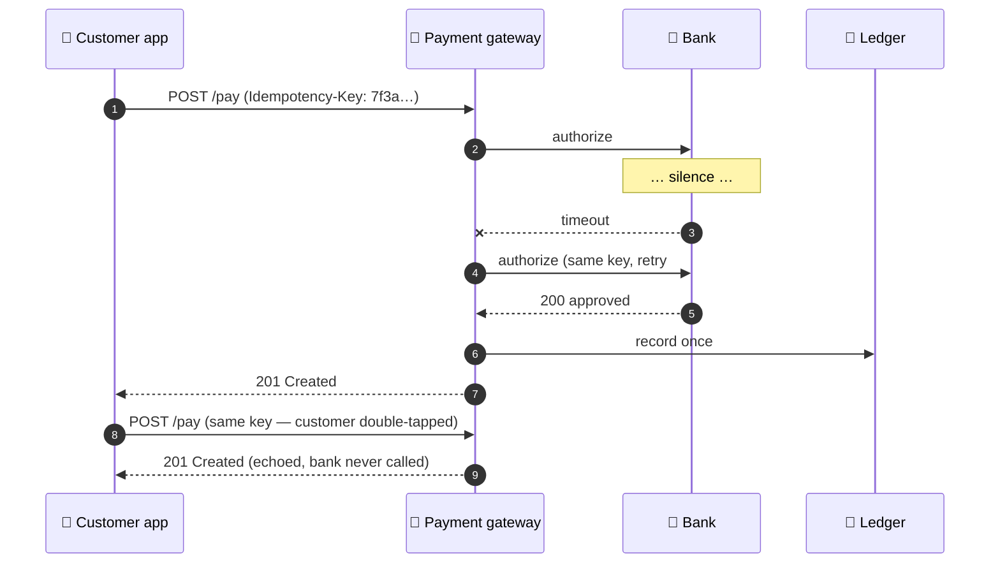

<div align="center">

<picture>
  <source media="(prefers-color-scheme: dark)" srcset="https://capsule-render.vercel.app/api?type=waving&color=0:0d1117,50:1a3a3a,100:58E1C1&height=180&section=header&text=ERDENE.K&fontSize=64&fontColor=58E1C1&fontAlignY=38&desc=backend%20systems%20%C2%B7%20fintech%20%C2%B7%20zero%20drama&descAlignY=60&descSize=18&animation=fadeIn&fontAlign=50">
  
</picture>

<picture>
  <source media="(prefers-color-scheme: dark)" srcset="https://readme-typing-svg.demolab.com?font=Share+Tech+Mono&size=24&duration=2600&pause=900&color=58E1C1&center=true&vCenter=true&width=640&lines=%3E+booting+erdene.k+v4.0...;%3E+Senior+Backend+Developer+%40+Tavan+Bogd+NBFI;%3E+500%2C000%2B+users.+All+systems+operational.;%3E+Building+the+systems+behind+the+money_">
  
</picture>

<br/><br/>


</div>

<br/>

```console
┌──────────────────────────────────────────────────────────────────┐
│  SYS.00 — BOOT SEQUENCE                                          │
├──────────────────────────────────────────────────────────────────┤
│  [ OK ] payments ........................ clearing               │
│  [ OK ] loans ........................... disbursing             │
│  [ OK ] documents ....................... generating             │
│  [ OK ] pdf-extraction middleware ....... parsing                │
│  [ OK ] code review ..................... nitpicking (lovingly)  │
├──────────────────────────────────────────────────────────────────┤
│  uptime: 4+ yrs in prod · users: 500,000+ · incidents: handled   │
└──────────────────────────────────────────────────────────────────┘
```

> [!TIP]
> **2026 focus:** payment infrastructure that fails loudly, retries safely, and never charges anyone twice.

<br/>

## `SYS.01 — whoami`

<table>
<tr>
<td width="55%" valign="top">

```console
$ whoami
erdene.k — backend engineer in fintech

$ cat mission.txt
Most of my work is invisible — and that's
the point. Good backend engineering means
payments clear, loans disburse, and documents
generate without anyone thinking about how.

$ history | tail -3
  frontend  → shipped a mobile loan app to 500K users
  deeper    → payment gateways, doc generation
  deepest   → PDF data-extraction for SME credit scoring
```

</td>
<td width="45%" valign="top">

```jsonc
{
  "name":      "Erdenechuluun Kh",
  "role":      "Senior Backend Developer",
  "at":        "Tavan Bogd NBFI",
  "domain":    ["fintech", "payments", "lending"],
  "does":      [
    "leads code reviews",
    "sets system standards",
    "keeps the money moving"
  ],
  "superpower": "turning manual back-office pain
                 into a service call",
  "fun_fact":  "led the winning team at Mongolia's
                 largest corporate hackathon 🥇"
}
```

</td>
</tr>
</table>

> I started in frontend, then moved down the stack. That path means I design APIs the way the people consuming them *wish* they were designed.

<br/>

## `SYS.02 — stack`

<div align="center">

**`// backend — where I live`**

<picture>
  <source media="(prefers-color-scheme: dark)" srcset="https://skillicons.dev/icons?i=java,spring,nodejs,ts,express&theme=dark">
  
</picture>

**`// frontend & mobile — where I came from`**

<picture>
  <source media="(prefers-color-scheme: dark)" srcset="https://skillicons.dev/icons?i=react,angular,flutter,sass&theme=dark">
  
</picture>

**`// infra & data — where it runs`**

<picture>
  <source media="(prefers-color-scheme: dark)" srcset="https://skillicons.dev/icons?i=aws,docker,postgres,mongodb,git,linux&theme=dark">
  
</picture>

<br/>

<sub>Plus the unglamorous stuff: payment gateways · banking APIs · loan origination · document generation · PDF processing · microservices · CI/CD</sub>

</div>

<br/>

## `SYS.03 — how a payment moves`

The thing I think about most. One payment, one bank that stops answering, and the idempotency key that makes sure the customer pays exactly once.



> [!NOTE]
> The [full interactive version](https://erdene-k.github.io/portofolio/) lets you switch between *the bank goes quiet*, *the customer double-taps*, and *nothing goes wrong*.

<br/>

## `SYS.04 — selected work`

| ID | Project | The story | Impact | Stack |
|:--:|---------|-----------|:------:|-------|
| `001` | **PayOn v2** | Mobile loan app — loyalty, integrations, full lending flow end to end | 👥 **500K+ users** | `React Native` `Payment gateway` |
| `002` | **Bank-statement intelligence** | Middleware that reads tabular data out of bank-statement PDFs and turns manual SME underwriting into a single API call | ⚡ manual → API | `Java` `PDF extraction` |
| `003` | **FC Parcel** | Travelers meet parcel senders — payments, tracking, matching. Built end-to-end as a BSc thesis in Paris | 🎓 thesis | `Angular` |
| `004` | **CyberGame** | Teaches people to spot phishing before phishing spots them | 🛡️ security edu | `Flutter` |

<details>
<summary><b>🧪 side experiments</b> — <i>click to expand</i></summary>
<br/>

| | | |
|--|--|--|
| 🌐 | **[Portfolio](https://erdene-k.github.io/portofolio/)** | Hand-built with vanilla HTML/CSS/JS. A payment sequence diagram you can break, and a box of tool chips with real physics. No frameworks were harmed. |
| 🔮 | **[Three.js with HDR](https://erdene-k.github.io/realism)** | Chasing photorealism in the browser, one render pass at a time. |

</details>

<br/>

## `SYS.05 — telemetry`

<div align="center">

<picture>
  <source media="(prefers-color-scheme: dark)" srcset="https://github-profile-summary-cards.vercel.app/api/cards/profile-details?username=erdene-k&theme=tokyonight">
  
</picture>

<picture>
  <source media="(prefers-color-scheme: dark)" srcset="https://github-profile-summary-cards.vercel.app/api/cards/repos-per-language?username=erdene-k&theme=tokyonight">
  
</picture>
<picture>
  <source media="(prefers-color-scheme: dark)" srcset="https://github-profile-summary-cards.vercel.app/api/cards/most-commit-language?username=erdene-k&theme=tokyonight">
  
</picture>

<br/><br/>

<picture>
  <source media="(prefers-color-scheme: dark)" srcset="https://streak-stats.demolab.com/?user=erdene-k&theme=tokyonight&hide_border=true&background=0d1117&ring=58E1C1&fire=58E1C1&currStreakLabel=58E1C1">
  
</picture>

<br/><br/>

<picture>
  <source media="(prefers-color-scheme: dark)" srcset="https://raw.githubusercontent.com/erdene-k/erdene-k/output/github-contribution-grid-snake-dark.svg">
  
</picture>

</div>

<br/>

## `SYS.06 — initiate contact`

<div align="center">

```console
$ ./contact --with erdene.k
> Have a system that needs building — or fixing?
> Establishing secure channel...
```

<br/>

[](https://www.linkedin.com/in/erdenechuluun-khuderchuluun-3926b2117/)
[](mailto:tesoro.ec@gmail.com)
[](https://erdene-k.github.io/portofolio/)

<br/><br/>

<picture>
  <source media="(prefers-color-scheme: dark)" srcset="https://capsule-render.vercel.app/api?type=waving&color=0:58E1C1,50:1a3a3a,100:0d1117&height=110&section=footer&text=%C2%A9%202026%20ERDENE.K%20%E2%80%94%20all%20systems%20operational%20%E2%9C%85&fontSize=14&fontColor=58E1C1&fontAlignY=70">
  
</picture>

</div>
